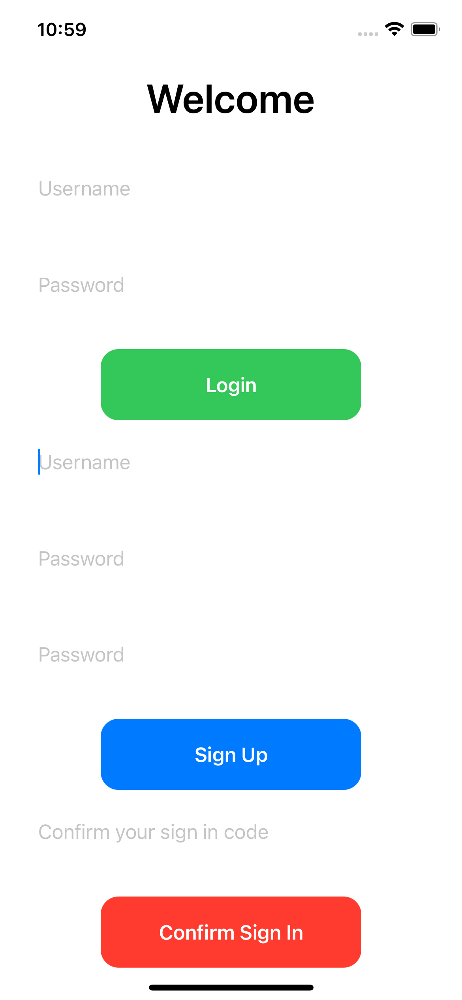

# Passwordless Login with Amplify

### Description
This blog demonstrates the way to create a passwordless login flow built on top of Amplify. We are using SwiftUI in this example.
See this blog for more details.

## Security

See [CONTRIBUTING](CONTRIBUTING.md#security-issue-notifications) for more information.

## License

This library is licensed under the MIT-0 License. See the LICENSE file.

